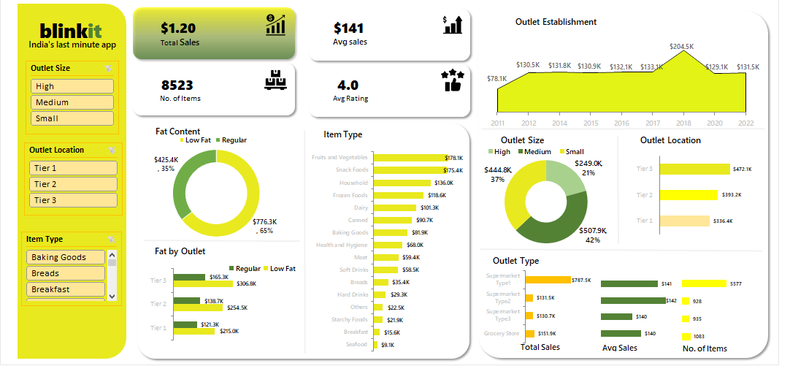

# 🛒 BlinkIT Sales Analysis  
📊 End-to-End Data Project | Excel • SQL • Python • Power BI  

---

## 🔍 Project Overview  
This project is an **end-to-end analysis of BlinkIT’s sales data**.  
The goal was to analyze **sales performance, customer satisfaction, and inventory distribution** using KPIs and dashboards.  

---

## 🛠 Tools & Technologies Used  
- **Excel** – Data cleaning, preprocessing, pivot tables, and dashboard creation  
- **SQL** – Queries to calculate KPIs and extract insights  
- **Python (Pandas, Matplotlib, Seaborn)** – Exploratory Data Analysis (EDA) and visualizations  
- **Power BI** – Interactive dashboard with KPIs and filters  

---

## 📂 Business Requirements  
The analysis was conducted to:  
- Track sales performance across different outlets and product categories  
- Measure customer satisfaction through ratings  
- Evaluate inventory distribution  
- Build dashboards for decision-making  

---

## ✅ Key KPIs  
- **Total Sales** – Overall revenue generated  
- **Average Sales** – Average revenue per transaction  
- **Number of Items Sold** – Total count of items sold  
- **Average Rating** – Customer satisfaction rating  

---

## 📊 Analysis Performed  
- Total Sales by Fat Content  
- Total Sales by Item Type  
- Fat Content vs Outlet Sales  
- Sales by Outlet Establishment Year  
- Sales by Outlet Size & Location  
- All Metrics by Outlet Type  

---

## 📸 Dashboards & Visuals  

### 🔗 Live Links  
- 📊 **Excel Dashboard:** [View on Google Drive](https://docs.google.com/spreadsheets/d/1mN_AYBhcziZ-Se-KOPx15B3WZZ55Y2Dp/edit?usp=sharing&ouid=109835531975614637095&rtpof=true&sd=true)  
- 🐍 **Python Notebook:** [View Notebook](https://github.com/Priyanka-Rawat890/BlinkIt-Sales-Analysis/blob/main/blinkit%20python/Blinkit%20Analysis%20in%20Python.ipynb)  
- 🗄️ **SQL Queries:** [View SQL File](https://github.com/Priyanka-Rawat890/BlinkIt-Sales-Analysis/blob/main/SQLQuery1.sql)  
- 🖼️ **Dashboard (Preview):** See screenshots below  

### Power BI Dashboard Preview  
  

### Excel Dashboard Preview  

---

## 📁 Project Workflow  
1. Imported and cleaned the dataset in Excel  
2. Created pivot tables and Excel dashboard  
3. Wrote SQL queries for KPIs and insights  
4. Performed EDA and visualizations in Python  
5. Built an interactive Power BI dashboard  

---

## 📊 Key Insights  
- Low Fat items contributed more to total sales compared to Regular items  
- Snack foods and dairy were the highest-selling product categories  
- Supermarket Type 1 outlets generated the most revenue  
- Tier 3 cities outperformed Tier 1 and Tier 2 in sales  
- Outlet size and establishment year influenced sales distribution  

---

## 👩‍💼 Author  
**Priyanka Rawat** – Aspiring Data Analyst  
- 📌 [LinkedIn](https://linkedin.com/in/priyanka-rawat-398bb4337)  
- 💻 [GitHub](https://github.com/Priyanka-Rawat890)  

